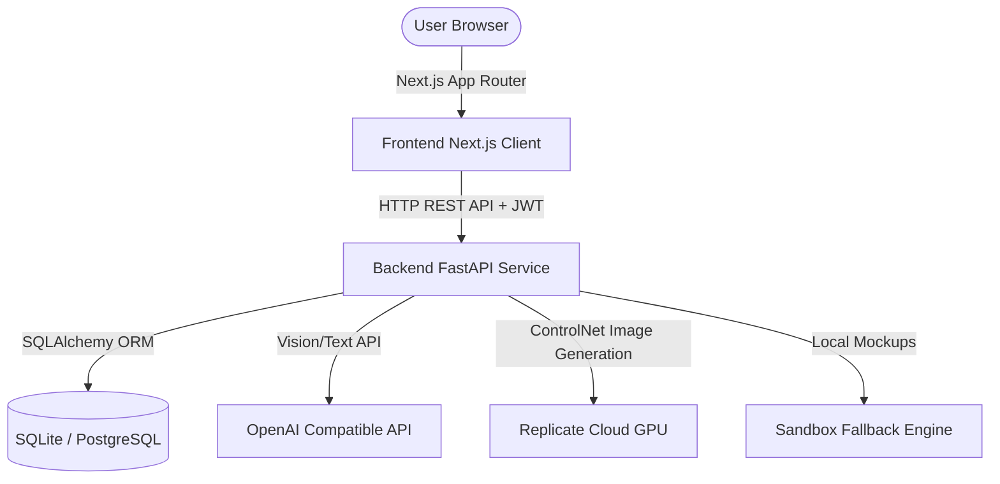

# System Architecture & AI Pipeline Guide

This document describes the technical architecture, design patterns, and AI processing pipelines of the RoomsGPT Studio platform.

---

## 🏗️ System Overview

RoomsGPT Studio is structured as a decoupled full-stack application:



### 1. Frontend Client
* **Framework**: Next.js 14 (App Router).
* **Styling**: Vanilla CSS Variables for responsive layout control, grid alignments, and themes.
* **Animations**: Framer Motion for smooth transitions, slide effects, and phase changes.
* **State Management**: React Context (`AuthContext`) for user authentication state, session storage, and workspace configurations.

### 2. Backend Service
* **Framework**: FastAPI (Asynchronous Python ASGI).
* **ORM**: SQLAlchemy with SQLite (local development) and PostgreSQL compatibility (production).
* **Security**: JWT-based access tokens for endpoint authentication.
* **Task Queuing**: Background tasks for handling heavy AI queries without blocking HTTP request threads.

---

## 🧠 The AI Renovation & Validation Pipeline

The core value of RoomsGPT Studio is its **Structure Lock Validation Engine**. When a user requests a room renovation, the backend runs an advanced pipeline designed to ensure structural continuity:

```mermaid
sequenceDiagram
    autonumber
    participant Client as Frontend Client
    participant API as FastAPI Router
    participant Service as AI Service
    participant OpenAIV as GPT-5.2 Vision
    participant Gen as Image Generator
    
    Client->>API: POST /designs (Upload image, style, prompt)
    API->>Service: Trigger generate_renovation()
    Service->>OpenAIV: Step 1: Scan original room structure
    OpenAIV-->>Service: Return room geometry, anchors, and constraint prompt
    Note over Service: Step 2: Inject structural constraints into final prompt
    
    rect rgb(25, 25, 35)
        Note over Service: Retry Loop (Max 2 Attempts)
        Service->>Gen: Step 3: Request generation (strict_preservation if attempt > 0)
        Gen-->>Service: Return generated image
        Service->>OpenAIV: Step 4: Compare generated image with original structure
        OpenAIV-->>Service: Return validation score (0.0 - 1.0) and feedback
    end
    
    alt Score >= 80%
        Note over Service: Status: Completed
    else Score < 80%
        Note over Service: Status: Failed (Blocks slider in UI)
    end
    
    Service-->>API: Return final design payload & validation result
    API->>Client: Send JSON Design Response
```



### Detailed Pipeline Stages

#### 1. Pre-Generation Structural Scan
Before calling any image generator, the original photo is sent to **GPT-5.2 Vision**. The engine analyzes the image for geometric anchors, wall boundaries, vanishing points, door/window placements, and structural shelving systems. It outputs a JSON analysis containing a highly-focused `constraint_prompt` (e.g., *"Preserve rectangular layout with back wall centered and corner shelves visible at angle"*).

#### 2. Prompt Engineering & Constraint Injection
The system combines the user's custom preferences, the selected style preset keywords, and the GPT-5.2 `constraint_prompt` into a master prompt. The layout preservation rules are frontloaded, as image models weigh early tokens more heavily.

#### 3. Image Generation Layer
The master prompt is passed to the operational image provider (Replicate ControlNet or OpenAI Images Edit). If the system is in retry mode (`strict_preservation=True`), it increases ControlNet strength (e.g., `0.98`) to lock the structural input maps.

#### 4. Post-Generation Quality Control
Once the image is generated, the original and renovated images are compared by GPT-5.2 Vision. The validator rates the structural alignment on three tiers:
* **90–100% (Excellent Match)**: Perfect layout alignment, only materials and decor changed.
* **80–89% (Acceptable Match)**: Slight perspective shifts or minor scale adjustments.
* **Below 80% (Failed Structure Preservation)**: Core geometry was modified (e.g. walls moved, new windows generated, perspective warped).

#### 5. Validation Auto-Retry
If the validation score falls below 80% on the first run, the pipeline automatically retries the generation. The second attempt features a strict warning prompt to the image model and sets `control_strength` to `0.98`. If the second attempt still fails, the design is stored with a `"failed"` status, preventing distorted renders from being displayed to users.

---

## 💾 Database Schema & Serialization

To support the structure validation tiers without changing database schemas or running migrations, the validation JSON metadata is serialized into the existing `detected_elements` text column:

```python
class Design(Base):
    __tablename__ = "designs"
    # ...
    detected_elements = Column(Text)  # Stores JSON-serialized validation metrics
```

The `Design` model uses SQLAlchemy properties to dynamically parse this JSON string at runtime, exposing `validation_score` and `validation_feedback` fields to Pydantic:

```python
@property
def validation_score(self) -> Optional[float]:
    if not self.detected_elements:
        return None
    try:
        data = json.loads(self.detected_elements)
        return float(data["score"])
    except:
        return None
```
This keeps database code modular and enables frontend validation badges and similarity progress bars.

---

## 🔒 Security Best Practices

1. **API Key Isolation**: Server-side keys are loaded using `os.getenv()`. Under no circumstances are raw keys logged. The logging layers use a mask utility (`_mask_key`) that only prints the first and last four characters of any token.
2. **Input Sanitization**: Client uploads are compressed locally to under 1MB to limit payload risks, and FastAPI enforces file type constraints (JPEG, PNG, WebP) and size limits (20MB max raw).
